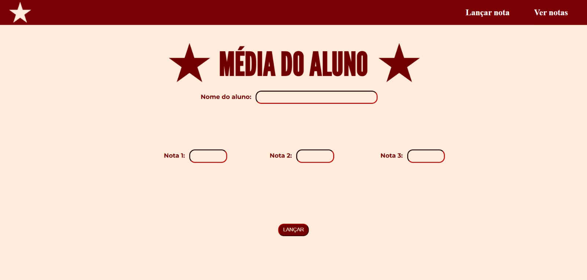
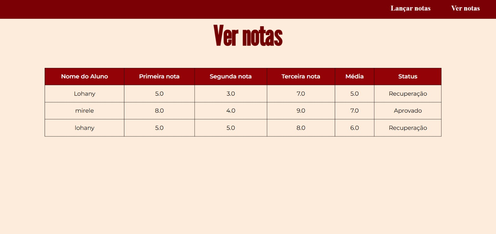

# Média aluno-Flask ๋࣭ ⭑

<i> O projeto A Média do Aluno utiliza um banco de dados para registrar as notas dos estudantes e calcular suas médias, gerando uma tabela contendo o nome de cada aluno, sua média final e o resultado da aprovação, tornando o processo de avaliação mais fácil.

# Desenvolvimento ✮

# Link . ݁₊ ⊹ . ݁˖ . ݁
[Site](https://media-aluno.onrender.com)
